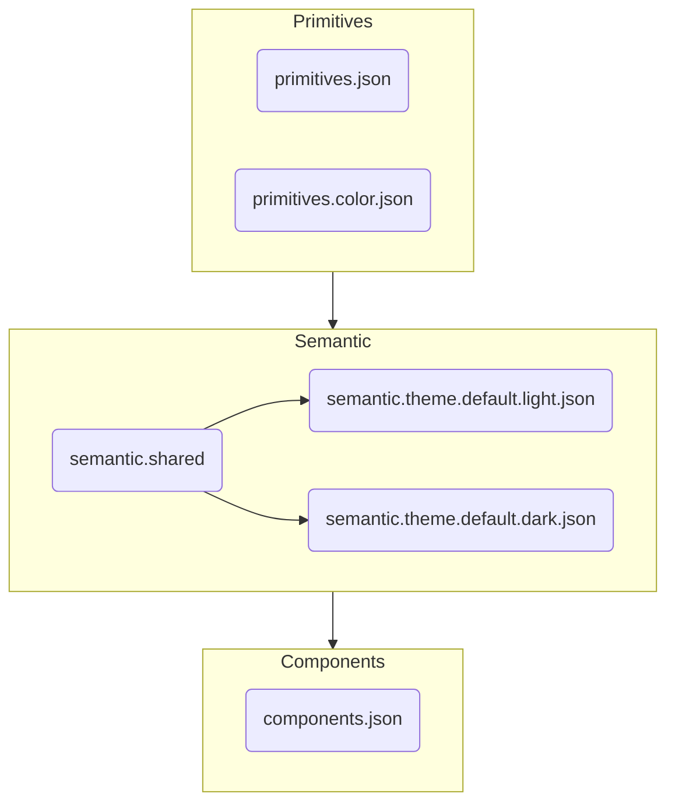

# Token Structure

This page explains how Cobalt tokens are organized and how to decide where a token belongs. Cobalt adopts a a three tiered structure for tokens: primitives, semantic, and components.

For designers working in Figma, the main idea is simple:

- **Primitives** are raw ingredients
- **Semantic tokens** describe design intent
- **Theme tokens** change that intent by theme or mode
- **Component tokens** are reserved for true component-specific needs

## Token Files

For developers, the tokens are stored in `@cobalt/tokens/tokens` as a collection of JSON files organized by the type of token and its purpose. The following diagram shows how the files are organized and relate to the three tiers of the token system:

## The Five Layers

Within the thriee tiers, there are five layers of token files that separate different types of values and design decisions:

| Layer                                | What it means                                            | Use it for                                                          | Examples                                                            |
| ------------------------------------ | -------------------------------------------------------- | ------------------------------------------------------------------- | ------------------------------------------------------------------- |
| `primitives.json`                    | Raw foundational values                                  | Spacing scale, radius scale, type scale, motion values, breakpoints | `space.4`, `shape.radius.sm`, `font.size.md`                        |
| `primitives.color.json`              | Raw color palette                                        | Neutral and brand ramps                                             | `neutral.100`, `cobalt.500`, `red.600`                              |
| `semantic.shared.json`               | Shared design decisions that stay the same across themes | Control sizing, focus rules, shared layout values                   | `control.height.md`, `control.radius`, `focus.ring.width`           |
| `semantic.theme.<theme>.<mode>.json` | Semantic tokens that change by theme or mode             | Mostly color behavior today                                         | `color.text.default`, `color.surface.default`, `color.primary.base` |
| `components.json`                    | Component-specific tokens                                | Public component contracts or intentional exceptions                | `component.avatar.size.md`                                          |

## Why The Five Layers

The five layer structure separates:

1. raw values
2. shared system rules
3. theme-specific changes
4. component-specific exceptions

This makes the token system easier to scale as more themes are added and easier to understand in Figma handoff.

## What This Means In Practice

### 1. Primitives are not design decisions

Primitives are the building blocks.

Examples:

- `font.size.md`
- `space.4`
- `shape.radius.sm`
- `blue.500`

These values exist so the system has a consistent base scale, but they do not explain how the value should be used.

### 2. Shared semantics describe the system's rules

`semantic.shared.json` is where we store design intent that should stay consistent across the whole system.

Examples:

- `focus.ring.width`
- `focus.ring.offset`
- `control.height.md`
- `control.radius`
- `layout.content.max.width.lg`

These tokens answer questions like:

- How tall is a medium control?
- What radius should standard controls use?
- How wide should shared content containers be?

### 3. Theme files only hold what changes by theme

`semantic.theme.<theme>.<mode>.json` is for semantic values that need to change when the theme changes.

Today, that is mostly color.

Examples:

- `color.text.default`
- `color.surface.raised`
- `color.border.focus`
- `color.interactive.primary.default`

This keeps theme files focused and prevents shared rules like typography or spacing from being repeated in every theme.

### 4. Component tokens stay selective

`components.json` is not meant to mirror the entire token system.

It exists for cases where a component has its own public sizing or behavior contract.

Example:

- `component.avatar.size.sm`
- `component.avatar.size.md`
- `component.avatar.size.lg`

This keeps component tokens useful without creating token bloat.

## A Simple Decision Guide

When adding or reviewing a token, ask these questions in order:

### Is this just a raw value?

If yes, it belongs in `primitives`.

Example:

- a new spacing step
- a new radius
- a new palette color

### Is this a reusable design rule across the system?

If yes, it belongs in `semantic.shared`.

Example:

- default control height
- default control radius
- focus ring width
- content max width

### Does this value change by theme or mode?

If yes, it belongs in `semantic.theme.<theme>.<mode>`.

Example:

- text color in light vs dark
- surface color in light vs dark
- interactive color in different branded themes

### Is this specific to one component?

If yes, it belongs in `components`.

Example:

- avatar size
- a unique component-only spacing rule
- a component shape that should not become a system-wide standard

## Common Examples

| Need                            | Best location                 | Why                                     |
| ------------------------------- | ----------------------------- | --------------------------------------- |
| Focus ring width                | `semantic.shared`             | It is a shared interaction rule         |
| Primary text color in dark mode | `semantic.theme.default.dark` | It changes by theme                     |
| Button and input height         | `semantic.shared`             | It is a shared control rule             |
| Avatar sizes                    | `components`                  | It belongs to Avatar, not every control |
| New gray ramp                   | `primitives.color`            | It is a raw palette                     |
| New radius scale step           | `primitives`                  | It is a foundational value              |

## About The `control` Section

The `control` section is for shared rules used by standard interactive controls.

Examples:

- buttons
- inputs
- selects
- segmented controls

Current control tokens cover:

- height
- radius

This was added so controls feel related to each other instead of each component inventing its own sizing rules.

This section should **not** be used for:

- avatars
- icons
- cards
- layout containers

## Recommended Figma Mindset

When working in Figma:

- use semantic tokens first
- use primitives when you are building the underlying system
- use theme tokens when reviewing light/dark or future brand theme behavior
- use component tokens only for real component-specific contracts

If a token feels like a system rule, it probably belongs in `semantic.shared`.

If it only makes sense for one component, it probably belongs in `components`.

## Related Pages

- [Token Reference](./index.md)
- [Typography](../foundations/typography.md)
- [Colors](../foundations/colors.md)
